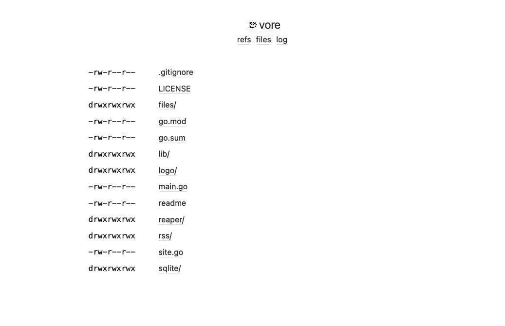

<!--
N.B.: This README was automatically generated by https://github.com/YunoHost/apps/tree/master/tools/README-generator
It shall NOT be edited by hand.
-->

# Vore pour YunoHost

[](https://dash.yunohost.org/appci/app/vore)  

[](https://install-app.yunohost.org/?app=vore)

*[Read this readme in english.](./README.md)*

> *Ce package vous permet d’installer Vore rapidement et simplement sur un serveur YunoHost.
Si vous n’avez pas YunoHost, regardez [ici](https://yunohost.org/#/install) pour savoir comment l’installer et en profiter.*

## Vue d’ensemble

Un lecteur de flux simple et multi-locataires

### Client:

- support rss et atom
- minimal, simple, fiable, rapide
- rafraîchir vos flux automatiquement
- afficher une liste chronologique des éléments du flux


**Version incluse :** 2023.08.09~ynh1

**Démo :** https://vore.website/j3s

## Captures d’écran



## Documentations et ressources

* Site officiel de l’app : <https://git.j3s.sh/vore>
* Documentation officielle de l’admin : <https://j3s.sh/thought/vore-a-new-rss-feed-reader.html>
* Dépôt de code officiel de l’app : <https://git.j3s.sh/vore/tree/main/>
* Documentation YunoHost pour cette app : <https://yunohost.org/app_vore>
* Signaler un bug : <https://github.com/YunoHost-Apps/vore_ynh/issues>

## Informations pour les développeurs

Merci de faire vos pull request sur la [branche testing](https://github.com/YunoHost-Apps/vore_ynh/tree/testing).

Pour essayer la branche testing, procédez comme suit.

``` bash
sudo yunohost app install https://github.com/YunoHost-Apps/vore_ynh/tree/testing --debug
ou
sudo yunohost app upgrade vore -u https://github.com/YunoHost-Apps/vore_ynh/tree/testing --debug
```

**Plus d’infos sur le packaging d’applications :** <https://yunohost.org/packaging_apps>